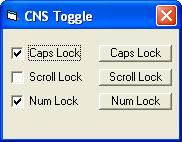



## Toggle Caps, Num, ScrLk

### Description

Detect Scroll, Num, Caps keys and toggle them on or off.
 
### More Info
 

             |
---                |---
**Submitted On**   |2006-01-23 02:02:38
**By**             |[OberCanober](https://github.com/Planet-Source-Code/PSCIndex/blob/master/ByAuthor/obercanober.md)
**Level**          |Beginner
**User Rating**    |5.0 (10 globes from 2 users)
**Compatibility**  |VB 6\.0
**Category**       |[Miscellaneous](https://github.com/Planet-Source-Code/PSCIndex/blob/master/ByCategory/miscellaneous__1-1.md)
**World**          |[Visual Basic](https://github.com/Planet-Source-Code/PSCIndex/blob/master/ByWorld/visual-basic.md)
**Archive File**   |[Toggle\_Cap1967291232006\.zip](https://github.com/Planet-Source-Code/obercanober-toggle-caps-num-scrlk__1-64117/archive/master.zip)

